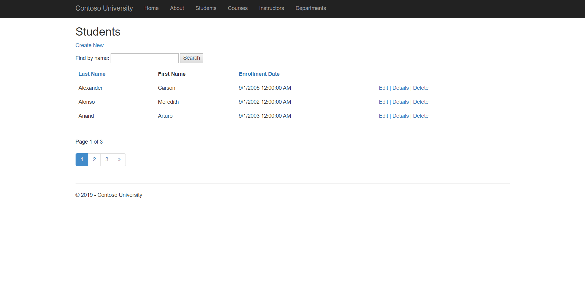
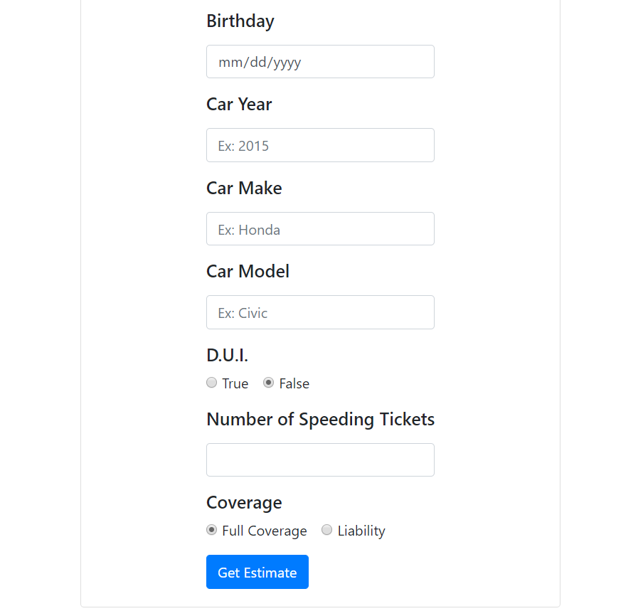

# TTA C# Projects
## Table of Contents
- [Contoso University](#contoso-university)
- [Car Insurance Quote](#car-insurance-quote)
- [C# Exercises](#c-exercises)

## Contoso University
Implemented CRUD (create, read, update, delete) funcionalities for Student objects and sorting, filtering, and paging functionalities for a Student table for a mock school. Based on a Microsoft tutorial. (HTML, CSS/Bootstrap, C#/ASP.NET MVC, SQL Server)

[Click here to see the code.](https://github.com/rbmanez/TTA-C-Sharp-Projects/tree/master/ContosoUniversity/ContosoUniversity)

##### Contoso University

## Car Insurance Quote
Genereates a car insurance quote based on a user's input. (HTML, CSS/Bootstrap, C#/ASP.NET MVC, SQL Server)

[Click here to see the code.](https://github.com/rbmanez/TTA-C-Sharp-Projects/tree/master/CarInsuranceQuote)

##### Car Insurance Quote - Top of the Page

##### Car Insurance Quote - Bottom of the Page

## C# Exercises
The C# Exercises are practice drills. Some concepts covered include comparison operators, boolean logic, strings, arrays and lists, iteration, methods, classes, inheritence, and more.

[Click here to see the code.](https://github.com/rbmanez/TTA-C-Sharp-Projects/tree/master/C-Sharp-Exercises)
