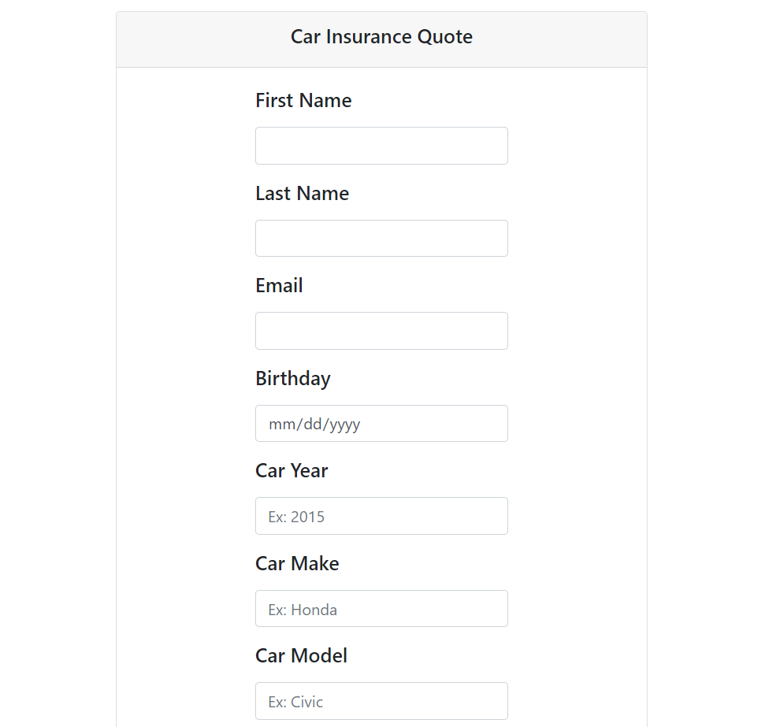

# TTA C# Projects
## Table of Contents
- [Contoso University](#contoso-university)
- [Car Insurance Quote](#car-insurance-quote)
- [C# Exercises](#c-exercises)

## Contoso University
This project was created following Microsoft's tutorial to gain more experience using Entity Framwork 6 Code-First, MVC, and implementing CRUD (create, read, update, delete) funcionalities for Student objects and sorting, filtering, and paging functionalities for a Student table.

[Click here to see the code.](https://github.com/rbmanez/TTA-C-Sharp-Projects/tree/master/ContosoUniversity/ContosoUniversity)

##### Contoso University

## Car Insurance Quote
This C#/ASP.NET MVC project genereates a car insurance quote based on the user's input. SQL Server, CSS/Bootstrap and HTML were also used.

[Click here to see the code.](https://github.com/rbmanez/TTA-C-Sharp-Projects/tree/master/CarInsuranceQuote)

##### Car Insurance Quote - Top of the Page

##### Car Insurance Quote - Bottom of the Page

## C# Exercises
The C# Exercises are practice drills. Some concepts covered include comparison operators, boolean logic, strings, arrays and lists, iteration, methods, classes, inheritence, and more.

[Click here to see the code.](https://github.com/rbmanez/TTA-C-Sharp-Projects/tree/master/C-Sharp-Exercises)
